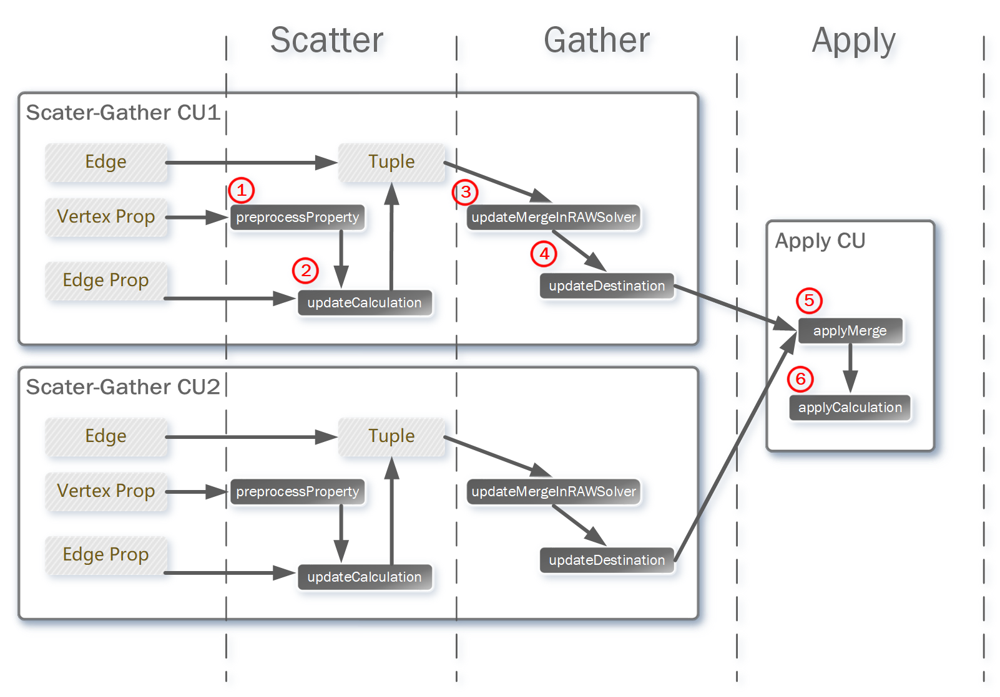

# Algorithm mapping
In this section, we introduce how to map new algorithms to our framework by using the __L2__ interface provide by ThunderGP, and an example is used to illustrate in details.

## Gather-Apply-Scatter(GAS) model

Our framework adopts an simplifed GAS processing model. The edges in one partition are streamed into __scatter__ stage, For each edges, the property of source vertices will be fetched from the global memory by the perfetching module, at the same time, the property of corresponding edge, or the weight of edge is loaded from global memory in stream, then these two value go through an algorithm-specific processing which return an update of the property of the destination vertex, finally, at the end of scatter stage, this update value and the destination of this edge is combined to create a update tuple. The update tuples are streamed into the shuffle stage which dispatches the tuples to corresponding gather processing engines(PEs). The __gather__ PEs accumulates the update value in local on-chip memory which is caching the property of destination vertices. After all the edges in this partition are processed, the cached data in gather PEs will be aggregated to the global memory. and the __apply__ stage which calls algorithm-specific function updates all the vertices for the next iteration.

There are two types of compute kernel in ThunderGP: the scatter-gather and the apply, and mapping a new graph analytic algorithms is equivalent to reconstruct these two compute kernels. From our observation on many graph analytic algorithms, we carefully make abstractions on the scatter-gather stage for programing efficiency.


## Compute kernel - Scatter-Gather


In our implementation, the gather and scatter stages are combined together by the internal shuffle data path(the shuffle stage), and the implementation of this compute kernel are highly hardware-specific, which is not friendly with the algorithm developers. Therefore, we provide __L2__ interface to hide the hardware details. Actually, the __L2__ functions acts as hooks, meaning that ThunderGP will call them for processing specific event in the data-flow. fllowing table and figure shows the description of __L2__ hooks:





| Hooks    | ID | Description  |
|-----------|--|--------------|
| preprocessProperty | 1 | Per-process the source vertex property. |
| updateCalculation | 2 | Calculate the update value by using the edge property and source vertex property.  |
| updateMergeInRAWSolver| 3 | Destination property update in RAW solver. | 
| updateDestination | 4 | Destination property update. | 
| applyMerge | 5 | Destination property merge from all of the scatter-gather CUs. | 

Notes: 

* The operation in ```updateDestination``` and ```updateMergeInRAWSolver``` can be very samiliar, the __difference__ is that  for ```updateDestination```, the data in on-chip memory is not initialized,  which means the accumulations are start from zero, but for ```updateMergeInRAWSolver```,  as the read-after-write hazard only happened in two very closed update tuples, we add a temporary buffer in RAWSolver to sift out the closed update and perform the update in the temporary buffer. Therefore if the update happened, the data in the temporary buffer is initialized. It should be considered when mapping an algorithm with bitmasked property(e.g. BFS).

*  ```applyMerge``` only used in multiple-SLRs.


by using __L2__ interface, mapping the scatter-gather stage of a new algorithm is very simple, it can also get a pretty good performance without touching the low-level code.

## Compute kernel - Apply

The apply stage of each graph analytic algorithm may need different type of data, and this variance makes the abstraction a little tough. Currently, mapping the apply stage of a new algorithm need additional step: add the interface code manually. It is easy to achieve as the processing in apply is very simple ,and our existing code can be a good reference. The steps are shown below:

* Modify the apply_kernel.mk
* Write the accelerator code in vertex_apply.cpp
* Write the host code and verifciation code in host_vertex_apply.cpp

we also provide a template in ```applcation/template``` for quick access, we are planning to to provide a script that will automatic generate the intfaces code for apply stage in the future.

## Example


